# NodeJS Basics Assignments

## Assignment4 - Node.js CLI commands

1. `FORCE_COLOR` : The FORCE_COLOR environment variable is used to enable ANSI colorized output. It accepts the following values:

   - `1`, `true`, or the empty string `''` indicate 16-color support,
   - `2` indicates 256-color support.
   - `3` indicates 16 million-color support.

   When FORCE_COLOR is used and set to a supported value, it overrides the `NO_COLOR`, and `NODE_DISABLE_COLORS` environment variables.

   Any other value disables colorized output.

   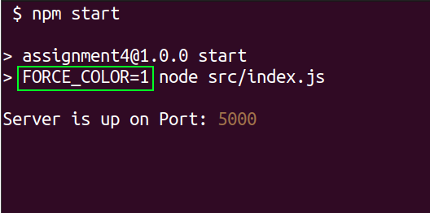

2. `NODE_DEBUG` : The `NODE_DEBUG` environment variable prints debug information for **core** modules. The value is a `','`(comma-separated) list of core modules.

   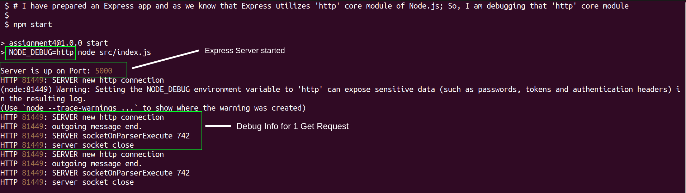

3. `NODE_DEBUG_NATIVE` : This environment variable is similar to `NODE_DEBUG` but prints low-level debug information from C++ modules in the Node.js implementation. The value is a `','`(comma-separated) list of core modules.

   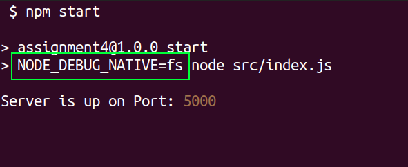

4. `NODE_DISABLE_COLORS` : This environment variable disables colors in Node.js stdout and REPL.

   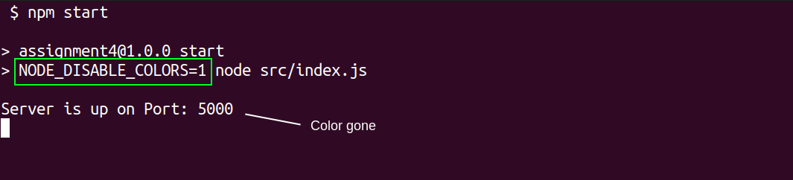

5. `NODE_EXTRA_CA_CERTS` : This variable allows you to add trusted root certificates to Node.js's certificate store, enabling secure HTTPS connections to servers that use these certificates.

   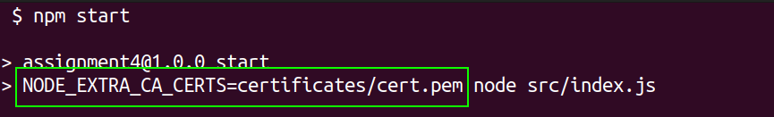

6. `NODE_NO_WARNINGS` : When set to `1`, process warnings are silenced.

   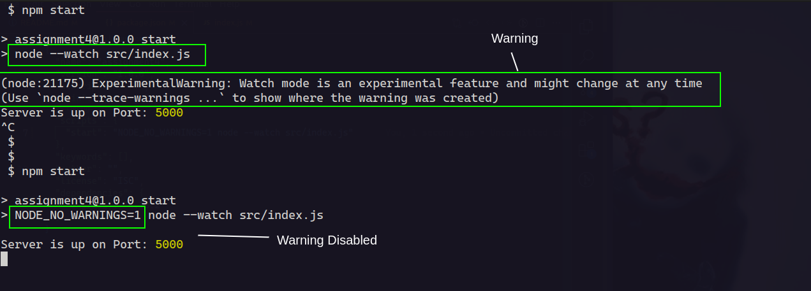

7. `NODE_OPTIONS` : The `NODE_OPTIONS` environment variable is a space-separated list of command-line options. These `options...` are interpreted before command-line options, so command-line options will override or compound after anything in `NODE_OPTIONS`. Node.js will exit with an error if an option not allowed in the environment is used.

   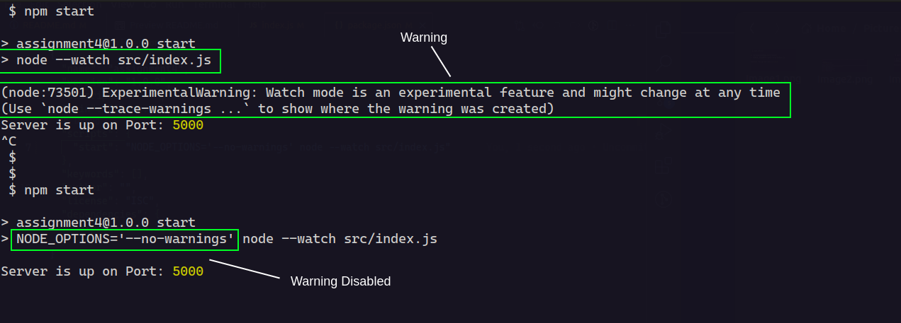

8. `NODE_PATH` : This environment variable expands the search for modules. By default, Node.js looks for modules in the `node_modules/` directory in the project root. Using `NODE_PATH`, you can specify other directories that contain modules. The value is a `':'`(colon-separated) list of directories on Unix-based systems, and a `';'`(semicolon-separated) list on Windows.

   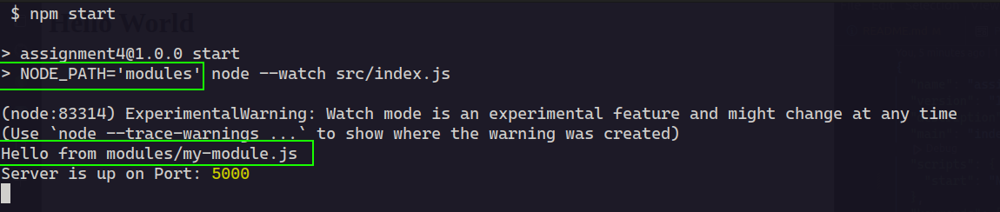

9. `NODE_PENDING_DEPRECATION` : When set to `1`, it emits pending deprecation warnings. Pending deprecations are similar to runtime deprecations, but they are turned off by default and require the `--pending-deprecation` command-line flag or the `NODE_PENDING_DEPRECATION=1` environment variable to be set. Pending deprecations help developers detect deprecated API usage early.

   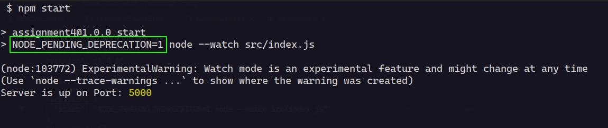

10. `NODE_PENDING_PIPE_INSTANCES` : This variable sets the number of pending pipe instance handles when the pipe server is waiting for connections. It applies to Windows only.

    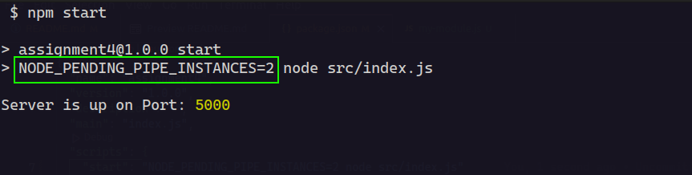

11. `NODE_PRESERVE_SYMLINKS` : When set to `1`, instructs the module loader to preserve symbolic links when resolving and caching modules.

    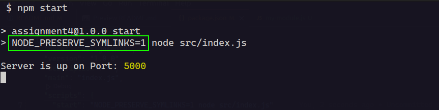

12. `NODE_REDIRECT_WARNINGS` : When set, process warnings are emitted to the specified file instead of printing to stderr. The file will be created if it doesn't exist and appended to if it does. If an error occurs while writing the warning to the file, it will be written to stderr instead. This is equivalent to using the `--redirect-warnings=file` command-line flag.

    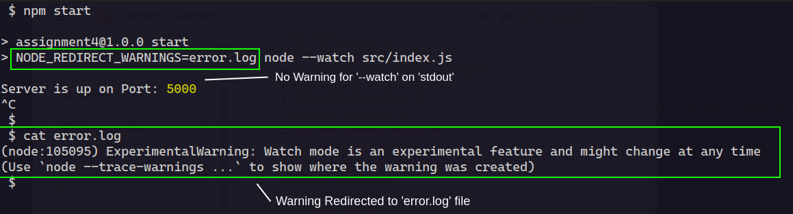

13. `NODE_REPL_HISTORY` : This variable specifies the path to the file used to store the persistent REPL history. By default, the path is `~/.node_repl_history`, but you can override it using this variable. Setting the value to an empty string (`''` or `' '`) disables persistent REPL history.

    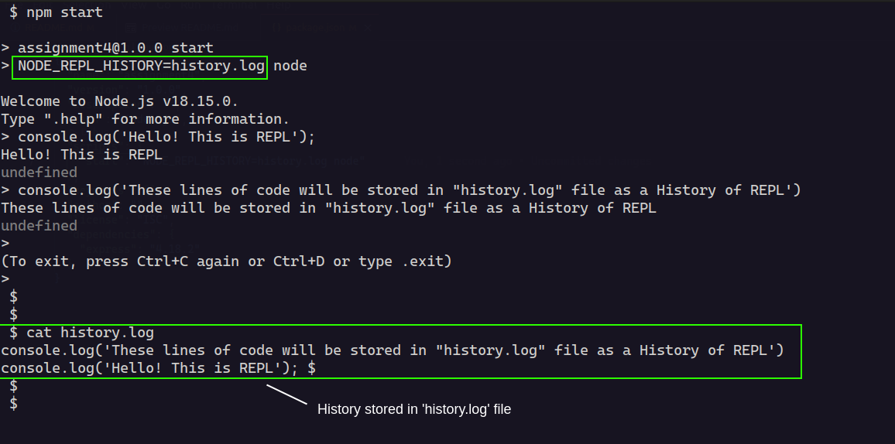

14. `NODE_REPL_EXTERNAL_MODULE` : This variable specifies the path to a Node.js module that will be loaded instead of the built-in `REPL`. Setting the value to an empty string (`''`) will use the built-in REPL.

    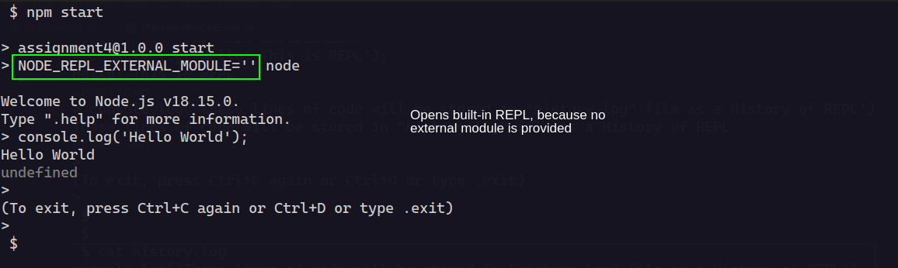

15. `NODE_SKIP_PLATFORM_CHECK` : When the value is `1`, the check for a supported platform is skipped during Node.js startup. Node.js might not execute correctly, and any issues encountered on unsupported platforms will not be fixed.

    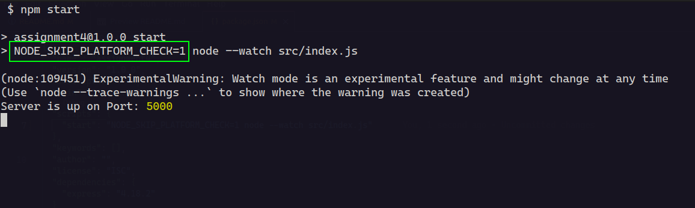

16. `NODE_TLS_REJECT_UNAUTHORIZED` : When the value is `0`, certificate validation is disabled for TLS connections, making TLS and HTTPS insecure. Using this environment variable is strongly discouraged.

    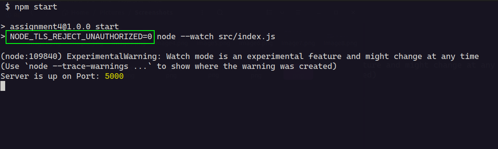

17. `NODE_V8_COVERAGE` : When set, Node.js outputs V8 JavaScript code coverage and Source Map data to the specified directory. Coverage information is written as JSON to files with a "coverage" prefix. This variable automatically propagates to subprocesses, making it easier to instrument applications that call the `child_process.spawn()` functions. Setting `NODE_V8_COVERAGE` to an empty string prevents propagation.

    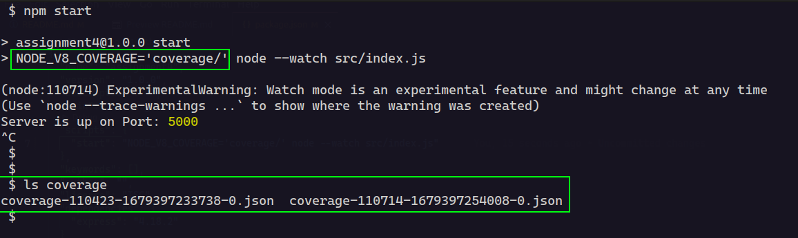

18. `NO_COLOR` : This is an alias for `NODE_DISABLE_COLORS`. The value of the environment variable is arbitrary.

    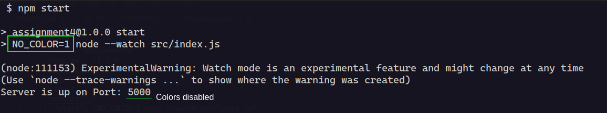

19. `OPENSSL_CONF` : This environment variable loads an OpenSSL configuration file on startup. It can be used, for example, to enable FIPS-compliant crypto if Node.js is built with `--openssl-fips`. If the `--openssl-config` command-line option is used, the environment variable is ignored.

    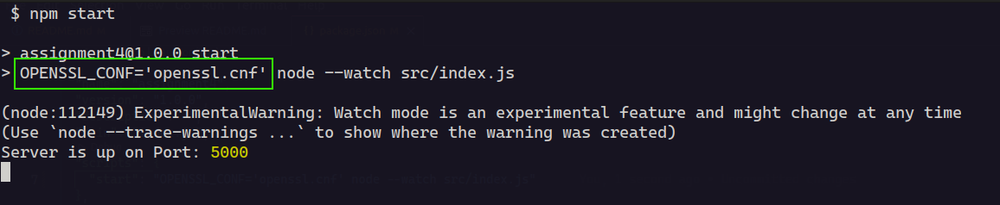

20. `SSL_CERT_DIR` : If `--use-openssl-ca` is enabled, this variable overrides and sets OpenSSL's directory containing trusted certificates. Be aware that unless the child environment is explicitly set, this environment variable will be inherited by any child processes using OpenSSL, causing them to trust the same CAs as Node.js.

    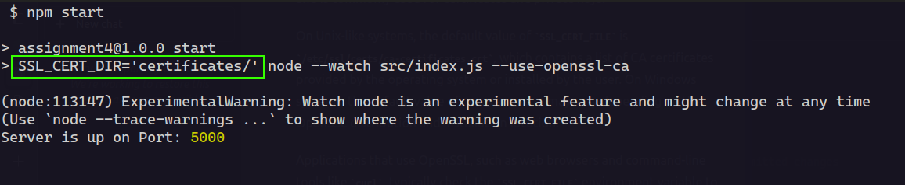

21. `SSL_CERT_FILE` : If `--use-openssl-ca` is enabled, this variable overrides and sets OpenSSL's file containing trusted certificates. Be aware that unless the child environment is explicitly set, this environment variable will be inherited by any child processes using OpenSSL, causing them to trust the same CAs as Node.js.

    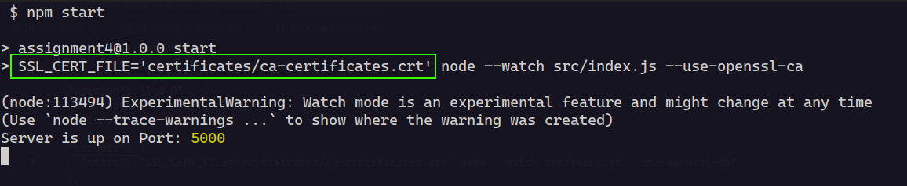

22. `TZ` : The TZ environment variable specifies the timezone configuration. Node.js supports basic timezone IDs such as `'Etc/UTC'`, `'Europe/Paris'`, or `'America/New_York'`. It may also support a few other abbreviations or aliases, but these are not guaranteed.

    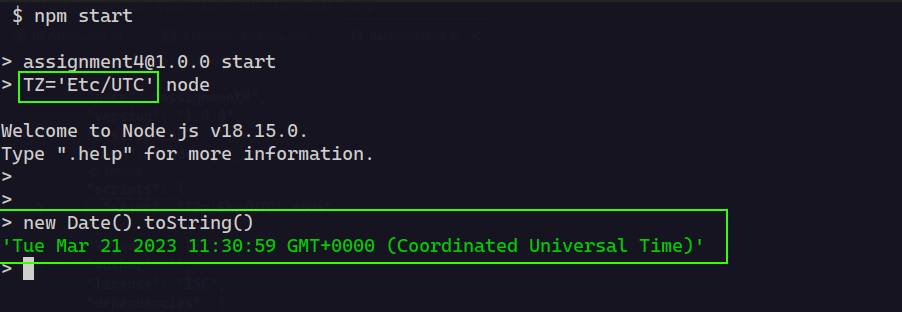

23. `UV_THREADPOOL_SIZE` : Set the number of threads used in libuv's threadpool to size threads.
    Asynchronous system APIs are used by Node.js whenever possible, but where they do not exist, libuv's threadpool is used to create asynchronous node APIs based on synchronous system APIs. Node.js APIs that use the threadpool are:

    - all fs APIs, other than the file watcher APIs and those that are explicitly synchronous
    - asynchronous crypto APIs such as crypto.pbkdf2(), crypto.scrypt(), crypto.randomBytes(), crypto.randomFill(), crypto.generateKeyPair()
    - dns.lookup()
    - all zlib APIs, other than those that are explicitly synchronous

    Because libuv's threadpool has a fixed size, it means that if for whatever reason any of these APIs takes a long time, other (seemingly unrelated) APIs that run in libuv's threadpool will experience degraded performance. In order to mitigate this issue, one potential solution is to increase the size of libuv's threadpool by setting the 'UV_THREADPOOL_SIZE' environment variable to a value greater than 4 (its current default value). For more information, see the libuv threadpool documentation.

    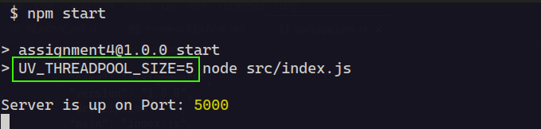

### Useful V8 Options

1. `--max-old-space-size` : This option sets the maximum memory size of V8's old memory section. As memory consumption approaches the limit, V8 will spend more time on garbage collection to free unused memory. Consider setting this option to a value that leaves some memory for other uses and avoids swapping. For example, on a machine with 2 GiB of memory, you can set `--max-old-space-size` to 1536 (1.5 GiB).

   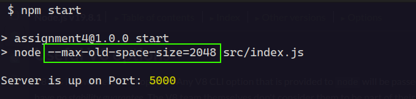

2. `--max-semi-space-size` : This option sets the maximum semi-space size for V8's scavenge garbage collector in megabytes (MiB). Increasing the max size of a semi-space may improve throughput for Node.js at the cost of more memory consumption. The default value is 16 MiB for 64-bit systems and 8 MiB for 32-bit systems. You can experiment with different values to find the best configuration for your application.

   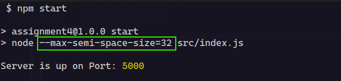
